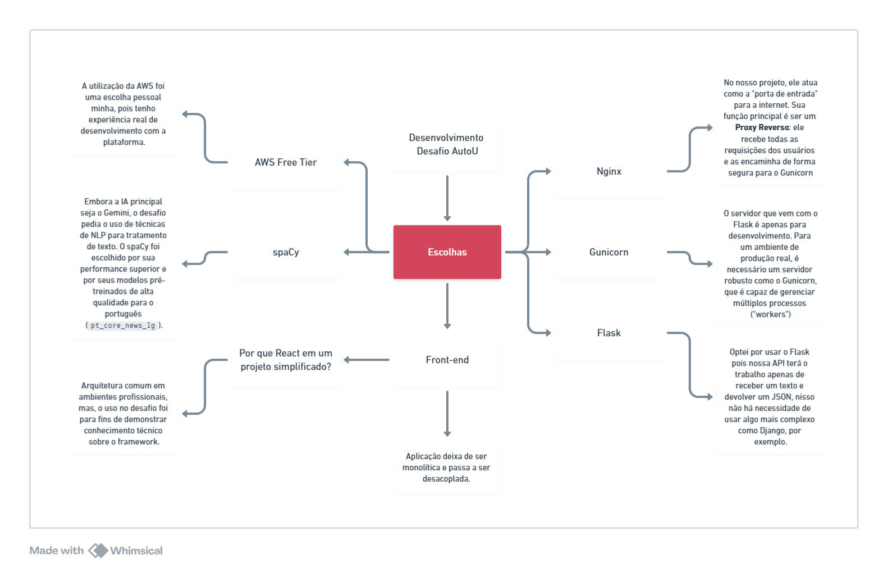

EmailFlow: Analisador de Emails com IA
---

Uma aplicação web que utiliza a API do Google Gemini para classificar o conteúdo de emails e sugerir respostas, construída com React, Flask e implantada na AWS.

